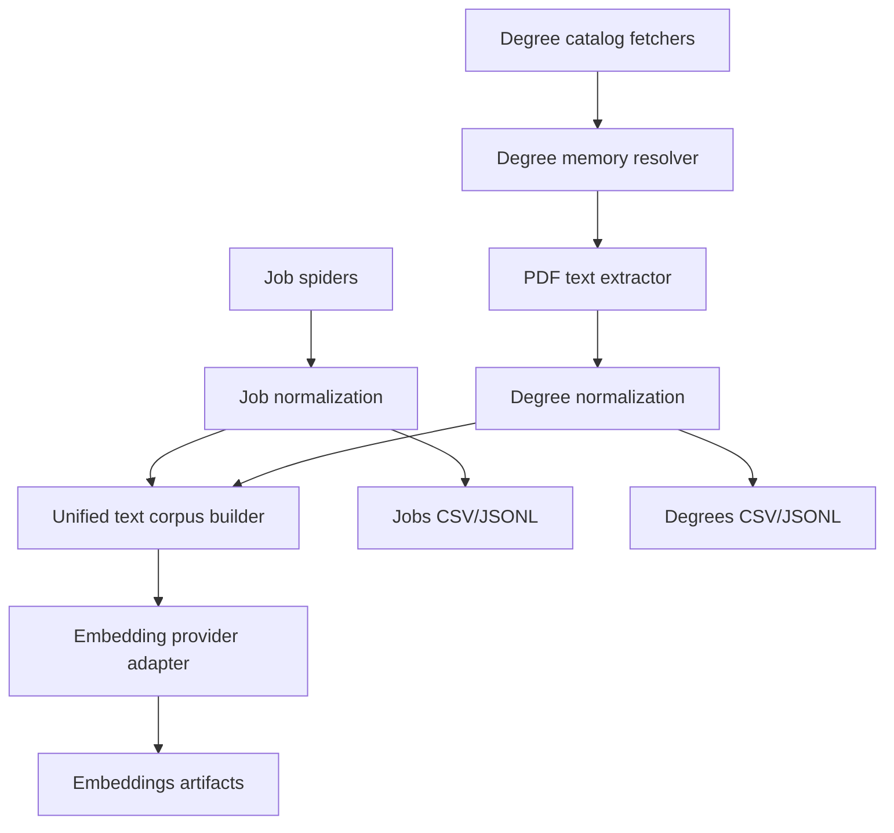
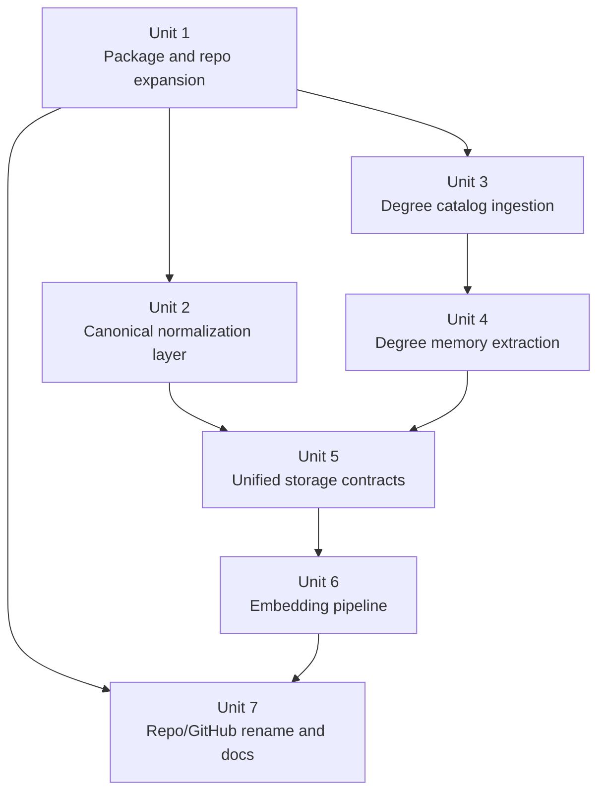
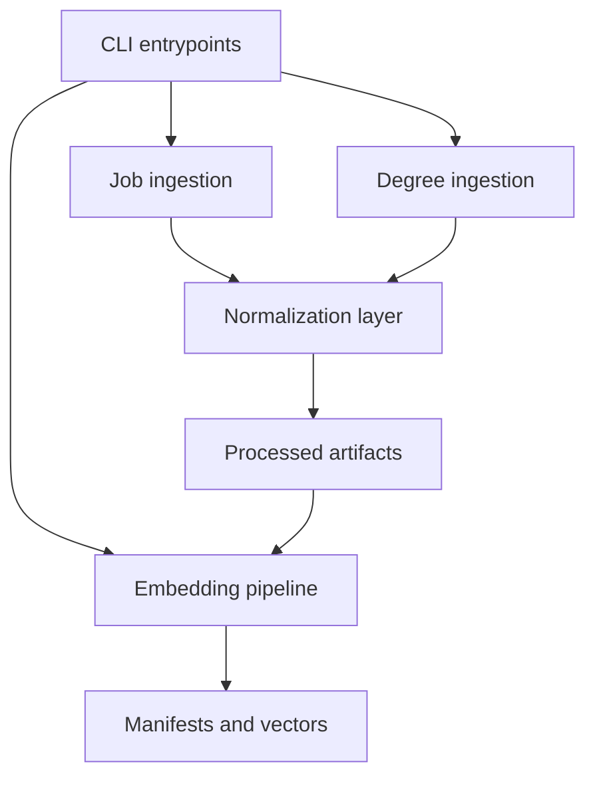

# feat: Expand pipeline into canarias-uni-ml

## Overview

Convert current job-only scraper into dual-domain pipeline that ingests Canary Islands job postings and Spanish university degree program descriptions, then produces normalized structured datasets and vector embeddings for matching and downstream ML work. The work spans four coupled surfaces: source acquisition, canonical data modeling, embedding provider integration, and repository/release identity.

| Surface | Current state | Planned state |
|---|---|---|
| Jobs dataset | Single CSV with loosely normalized geography and contract labels | Canonical taxonomies for province, municipality, island, contract type, plus raw values preserved |
| University dataset | Not present | Degree catalog + ANECA/RUCT-backed metadata + extracted degree descriptions |
| Semantic layer | Not present | Shared embedding pipeline for jobs and degrees with provider abstraction |
| Repo identity | `canarias-web-scrpr` / package `canarias_jobs` | `canarias-uni-ml` / package namespace aligned with broader scope |

## Problem Frame

Current repository solves one narrow step: scrape job offers into CSV. Requested direction is broader and changes project identity. Pipeline must also cover university degrees, using public degree-verification materials to obtain rich textual descriptions comparable to job descriptions. Once both corpora exist, they must be embedded with a low-cost provider path suitable for experimentation before larger-scale runs.

Planning bootstrap assumptions used here because no matching recent requirements document exists:
- Degree universe means official university degrees first (`grado`), with national coverage rather than Canary-only scope.
- ANECA/RUCT sources are authoritative for title discovery and evaluation metadata, but degree-memory PDFs may still need university-hosted URLs when ANECA only exposes reports and summary records.
- Embeddings are batch/offline artifacts written by pipeline jobs, not generated on-demand inside a serving API.
- Repository rename should include local folder, GitHub repository, Python package/import paths, and output/documentation naming.

## Requirements Trace

- R1. Preserve existing job scraping pipeline while broadening repo scope to universities and ML.
- R2. Add ingestion for all official degree programs, anchored in authoritative public sources and degree-memory documents.
- R3. Extract a reusable, comparable textual description per degree program suitable for semantic matching against job descriptions.
- R4. Canonicalize `province`, `municipality`, `island`, and `contract_type` in job outputs so equivalent values collapse to one code/value pair.
- R5. Add embedding generation for both jobs and degrees through a provider abstraction that supports OpenAI first and a low-cost fallback path.
- R6. Preserve raw provenance, URLs, and original labels so normalization remains auditable.
- R7. Rename project/repository/package from job-scraper framing to `canarias-uni-ml` without breaking core workflows.
- R8. Keep implementation testable with sample-based fixtures because live sites and PDFs are unstable.

## Scope Boundaries

- Non-goal: full production ranking or recommendation engine in this phase.
- Non-goal: vector database deployment; file-based artifacts are sufficient initially.
- Non-goal: coverage of master’s and doctoral programs in initial delivery unless the catalog abstraction makes extension trivial.
- Non-goal: OCR-heavy scanned PDFs as first-class supported input; initial pipeline should handle born-digital PDFs first and quarantine failures.
- Non-goal: replacing all existing spiders at once; job source extraction stays source-specific.

## Context & Research

### Relevant Code and Patterns

- `src/canarias_jobs/models.py` defines flat `JobRecord` dataclass; current schema expansion should follow this central-model pattern.
- `src/canarias_jobs/cli.py` already centralizes pipeline entrypoints (`run`, `run_merge`, scale flags); new domains should extend CLI through subcommands or explicit modes rather than ad hoc flags.
- `src/canarias_jobs/scale.py` already performs post-fetch cleaning, dedupe, and output writing; structured normalization belongs in a shared post-processing layer, not scattered across spiders.
- `src/canarias_jobs/utils.py` contains lightweight text/date/location helpers; canonical taxonomies can grow from here or move into a dedicated normalization module.
- `src/canarias_jobs/spiders/base.py` provides `SpiderResult` and `SpiderError`; university ingestion should mirror this pattern with domain-specific fetcher interfaces.
- Existing spiders (`src/canarias_jobs/spiders/sce.py`, `src/canarias_jobs/spiders/turijobs.py`, `src/canarias_jobs/spiders/jobspy_spider.py`, `src/canarias_jobs/spiders/infojobs.py`) keep extraction rules local to source modules, which should remain true after refactor.
- `tests/test_indeed_api.py` shows sample-based parsing tests already fit repo conventions.

### Institutional Learnings

- No `docs/solutions/` directory exists yet. Plan should add durable source/normalization notes as implementation creates new institutional knowledge.

### External References

- OpenAI Help: ChatGPT billing and API billing are separate systems; ChatGPT Plus/Pro does not automatically fund API usage.
- OpenAI docs/pricing: `text-embedding-3-small` is current low-cost OpenAI embedding option and supports free-tier rate limits; good default for first pass.
- ANECA degree search/reports: ANECA public title search exposes official evaluation reports and title metadata, useful for authoritative seed catalog and traceability.
- ANECA VERIFICA guidance confirms the degree memory is the canonical descriptive document universities submit during verification, even though public access may vary by university.

## Key Technical Decisions

| Decision | Choice | Rationale |
|---|---|---|
| Domain model | Split pipeline into `jobs`, `degrees`, `embeddings`, `normalization` modules under one package | Current flat job-only layout will not scale cleanly to multi-domain ingestion |
| Degree seed source | Use authoritative title discovery first, memory retrieval second | Separates “what titles exist” from “where rich description lives,” reducing scraper fragility |
| Description extraction | Store both extracted canonical description and raw excerpt/source metadata | Needed for auditability and later parser improvements |
| Normalization strategy | Use controlled vocabularies plus alias maps, never destructive text-only cleanup | Prevents `Indefinido`/`INDEFINIDO` drift while preserving original values |
| Embedding integration | Provider adapter with OpenAI default, Groq-compatible fallback slot, file-based output | Avoids locking pipeline to one paid vendor during experimentation |
| Output format | Keep CSV for tabular exports, add JSONL/Parquet-ready intermediate artifacts for richer fields | Degree metadata and embeddings will outgrow flat CSV alone |
| Rename posture | Rename repo/package once compatibility shims and docs are ready, not as first isolated change | Reduces broken imports/commands during transition |

## Open Questions

### Resolved During Planning

- Should ChatGPT subscription be treated as API credit? No. API billing must be configured separately on `platform.openai.com`; plan therefore includes provider health checks and fallback support.
- Which OpenAI embedding model should be default first pass? `text-embedding-3-small`, due to current low price and multilingual suitability.
- Should normalization overwrite raw scraped strings? No. Canonical and raw fields should coexist.
- Should degree ingestion start from all university types or only Canary universities? All official universities, because request explicitly targets all universities.

### Deferred to Implementation

- Exact authoritative endpoint/query strategy for enumerating all current `grado` titles across RUCT/ANECA public interfaces.
- Exact PDF parsing fallback stack for difficult university memory layouts (`pymupdf`, `pdfplumber`, OCR fallback) after fixture sampling.
- Final embedding chunking thresholds after measuring real token lengths of job and degree descriptions.
- Whether package rename should preserve temporary import shim `src/canarias_jobs/__init__.py` for one release window.
- Exact GitHub remote rename/push choreography, which depends on current auth and branch policy at execution time.

## High-Level Technical Design

> *This illustrates intended approach and is directional guidance for review, not implementation specification. Implementing agent should treat it as context, not code to reproduce.*

## Implementation Units

- [ ] **Unit 1: Restructure package around multi-domain pipeline**

**Goal:** Create project structure that can host job scraping, university ingestion, normalization, and embeddings without continuing job-only naming assumptions.

**Requirements:** R1, R5, R7

**Dependencies:** None

**Files:**
- Create: `src/canarias_uni_ml/__init__.py`
- Create: `src/canarias_uni_ml/cli.py`
- Create: `src/canarias_uni_ml/config.py`
- Create: `src/canarias_uni_ml/io.py`
- Create: `src/canarias_uni_ml/jobs/__init__.py`
- Create: `src/canarias_uni_ml/jobs/spiders/__init__.py`
- Create: `src/canarias_uni_ml/normalization/__init__.py`
- Create: `src/canarias_uni_ml/embeddings/__init__.py`
- Create: `src/canarias_uni_ml/degrees/__init__.py`
- Modify: `README.md`
- Modify: `requirements.txt`
- Test: `tests/test_cli_modes.py`

**Approach:**
- Introduce new top-level package namespace aligned with final repo identity.
- Move or mirror existing job pipeline modules into `jobs/` subpackage, keeping current logic intact while establishing clear seams for new domains.
- Replace monolithic CLI flags with explicit task surfaces such as `jobs scrape`, `jobs merge`, `degrees scrape`, `embed build`, or equivalent mode structure.
- Centralize path/config/env handling early so later units do not duplicate output and credential logic.

**Execution note:** Add characterization coverage around current CLI behaviors before migrating imports and entrypoints.

**Patterns to follow:**
- `src/canarias_jobs/cli.py` for single entrypoint pattern.
- `src/canarias_jobs/spiders/base.py` for small interface objects.

**Test scenarios:**
- Happy path: legacy job scrape mode still resolves configured output path and exits successfully with mocked spiders.
- Happy path: new degree/embed mode argument parsing routes to correct handler without invoking unrelated domains.
- Edge case: missing provider credentials for embed mode returns domain-specific configuration error, not generic stack trace.
- Error path: incompatible old flag combination yields clear migration message.
- Integration: package can still be executed with module entrypoint after namespace move.

**Verification:**
- Repo has one coherent package namespace for future work, and job workflow behavior is preserved behind compatibility entrypoints or migration messages.

- [ ] **Unit 2: Build canonical normalization layer for geography and contract type**

**Goal:** Replace free-text drift in core job dimensions with controlled vocabularies and auditable alias normalization.

**Requirements:** R1, R4, R6

**Dependencies:** Unit 1

**Files:**
- Create: `src/canarias_uni_ml/normalization/geography.py`
- Create: `src/canarias_uni_ml/normalization/contracts.py`
- Create: `src/canarias_uni_ml/normalization/models.py`
- Create: `data/reference/canary_municipalities.csv`
- Create: `docs/source-normalization.md`
- Modify: `src/canarias_uni_ml/jobs/models.py`
- Modify: `src/canarias_uni_ml/jobs/cleaning.py`
- Modify: `src/canarias_uni_ml/jobs/spiders/sce.py`
- Modify: `src/canarias_uni_ml/jobs/spiders/turijobs.py`
- Modify: `src/canarias_uni_ml/jobs/spiders/jobspy_spider.py`
- Modify: `src/canarias_uni_ml/jobs/spiders/infojobs.py`
- Test: `tests/test_geography_normalization.py`
- Test: `tests/test_contract_normalization.py`

**Approach:**
- Define canonical enums/codes for province, island, municipality, and contract type.
- Preserve `raw_location` and raw contract labels while adding canonical fields or replacing current user-facing fields with canonical values plus dedicated `*_raw` fields.
- Normalize centrally after scraping; spiders may emit hints, but canonicalization should be source-agnostic.
- Back normalization with explicit alias tables and municipality-to-island/province reference data instead of substring heuristics only.

**Technical design:** *(directional only)* Canonicalizer receives partial `(province, municipality, island, raw_location, contract_type)` and returns `(canonical values, source confidence, raw echoes)`; unresolved values are quarantined for later alias review, not silently coerced.

**Patterns to follow:**
- `src/canarias_jobs/scale.py` `_clean_record` and `_clean_and_dedupe` central post-processing pattern.
- `src/canarias_jobs/utils.py` helper style for focused normalization functions.

**Test scenarios:**
- Happy path: `INDEFINIDO`, `Indefinido`, and `contrato indefinido` all normalize to same canonical contract value.
- Happy path: municipality alias like `Las Palmas de G.C.` resolves to canonical municipality, island, and province.
- Edge case: record with island only infers province and leaves municipality null.
- Edge case: ambiguous `Canarias` location does not fabricate municipality and is marked unresolved or low-confidence.
- Error path: unknown contract label is preserved in raw field and mapped to `other`/null according to chosen taxonomy policy.
- Integration: mixed-source records processed through shared cleaning layer emit same canonical values regardless of source casing.

**Verification:**
- Job output fields for geography and contract type have stable controlled values, and unresolved raw variants are traceable for maintenance.

- [ ] **Unit 3: Ingest official degree catalog and source provenance**

**Goal:** Add first-class degree dataset with authoritative identifiers, university metadata, and source URLs before full text extraction.

**Requirements:** R2, R6, R7, R8

**Dependencies:** Unit 1

**Files:**
- Create: `src/canarias_uni_ml/degrees/models.py`
- Create: `src/canarias_uni_ml/degrees/catalog.py`
- Create: `src/canarias_uni_ml/degrees/sources/aneca.py`
- Create: `src/canarias_uni_ml/degrees/sources/ruct.py`
- Create: `src/canarias_uni_ml/degrees/sources/base.py`
- Create: `data/processed/degrees_catalog.csv`
- Create: `docs/degree-sources.md`
- Test: `tests/test_degree_catalog_parsing.py`

**Approach:**
- Separate degree discovery from memory download.
- Model each degree with stable identifiers where available: university, title name, branch, modality, credits, official code/expedient, source URLs, and status.
- Prefer ANECA/RUCT public metadata as seed catalog. When one source lacks a field, merge complementary metadata rather than trusting one surface exclusively.
- Write catalog outputs even when memory URL is unresolved so text extraction can lag catalog coverage.

**Patterns to follow:**
- `src/canarias_jobs/spiders/base.py` for fetch result contracts.
- Existing CSV writing flow from `src/canarias_jobs/utils.py` / future `io.py` for processed artifacts.

**Test scenarios:**
- Happy path: sample ANECA/RUCT result list parses into degree records with stable identifier and university/title fields.
- Edge case: same degree appears in both sources with slight title formatting differences and merges into one catalog row.
- Edge case: degree present without public memory URL still lands in catalog with unresolved-text status.
- Error path: source pagination or filtering returns partial page; parser does not duplicate prior degrees.
- Error path: upstream schema change on optional field degrades gracefully while preserving core identifiers.
- Integration: catalog builder emits deterministic rows and provenance metadata for downstream memory resolution.

**Verification:**
- Pipeline can produce national degree catalog artifact independent of PDF extraction success rate.

- [ ] **Unit 4: Resolve and parse degree memory documents into comparable descriptions**

**Goal:** Retrieve public memory documents and extract one clean description per degree program suitable for semantic comparison with jobs.

**Requirements:** R2, R3, R6, R8

**Dependencies:** Unit 3

**Files:**
- Create: `src/canarias_uni_ml/degrees/memory_locator.py`
- Create: `src/canarias_uni_ml/degrees/pdf_extract.py`
- Create: `src/canarias_uni_ml/degrees/description_builder.py`
- Create: `data/processed/degrees_descriptions.csv`
- Create: `data/raw/memories/.gitkeep`
- Modify: `requirements.txt`
- Test: `tests/test_memory_locator.py`
- Test: `tests/test_degree_pdf_extract.py`
- Test: `tests/test_degree_description_builder.py`

**Approach:**
- Resolve candidate memory URLs from authoritative records first, then fall back to university pages when public ANECA metadata lacks direct PDF link.
- Download with provenance fields (`memory_url`, `fetched_at`, checksum, content type`) and cache locally outside git-tracked dumps except fixtures.
- Extract text from born-digital PDFs, then identify descriptive sections most comparable to job descriptions, such as title presentation, competencies, professional profiles, learning outcomes, and justification.
- Build a canonical `degree_description` field from selected sections, not entire raw PDF text, to reduce noise before embeddings.
- Mark extraction status explicitly (`ok`, `missing_pdf`, `scanned_pdf`, `parse_failed`, `needs_review`).

**Execution note:** Start with characterization fixtures from 5-10 heterogeneous university memories before generalizing extraction heuristics.

**Technical design:** *(directional only)* `memory_locator` finds URL candidates -> `pdf_extract` returns structured sections per PDF -> `description_builder` composes normalized summary text and stores section provenance used.

**Patterns to follow:**
- Existing source-local extraction approach from job spiders.
- Sample-based parser tests in `tests/test_indeed_api.py`.

**Test scenarios:**
- Happy path: born-digital memory PDF yields extracted sections and non-empty canonical degree description.
- Happy path: same degree rerun with cached PDF skips redundant download and preserves checksum.
- Edge case: PDF lacks expected heading names but still contains recognizable professional profile/competency text; fallback section matcher succeeds.
- Edge case: scanned/image-only PDF is marked `needs_review` or `scanned_pdf` instead of producing garbage text.
- Error path: missing or dead memory URL produces unresolved status without aborting full degree batch.
- Error path: malformed PDF or extractor exception quarantines only affected degree.
- Integration: catalog row + extracted description combine into final degree dataset with provenance and status fields.

**Verification:**
- Degree pipeline yields structured description artifact with explicit coverage/error states, not opaque raw PDF blobs.

- [ ] **Unit 5: Define unified dataset contracts and artifact outputs**

**Goal:** Ensure jobs, degrees, and downstream embeddings share stable schemas and reproducible artifact paths.

**Requirements:** R1, R3, R4, R5, R6

**Dependencies:** Units 2, 4

**Files:**
- Create: `src/canarias_uni_ml/artifacts.py`
- Modify: `src/canarias_uni_ml/jobs/models.py`
- Modify: `src/canarias_uni_ml/degrees/models.py`
- Create: `src/canarias_uni_ml/corpus/models.py`
- Create: `docs/data-contracts.md`
- Modify: `src/canarias_uni_ml/io.py`
- Test: `tests/test_artifact_contracts.py`

**Approach:**
- Formalize three artifact layers: source-domain records, normalized domain records, semantic corpus records.
- Keep domain-specific outputs (`jobs_normalized.csv`, `degrees_descriptions.csv`) plus one shared corpus artifact with fields needed for embeddings (`entity_type`, `entity_id`, `text`, `language`, `source_url`, `updated_at`, status/provenance fields).
- Add versioned artifact naming or manifest metadata so reruns are auditable and comparable.
- Decide now whether embeddings write alongside corpus as JSONL/Parquet/NumPy rather than stuffing vectors into CSV cells.

**Patterns to follow:**
- Current `JobRecord` dataclass central schema pattern.
- Current processed output convention under `data/processed/`.

**Test scenarios:**
- Happy path: normalized job record serializes with canonical geography + raw provenance fields.
- Happy path: degree description record serializes with extraction status and source provenance.
- Edge case: text field missing on unresolved degree excludes it from corpus artifact but keeps domain artifact intact.
- Integration: corpus builder merges jobs and degrees into deterministic shared schema for embedding stage.
- Error path: artifact writer rejects records missing required stable identifier fields.

**Verification:**
- Downstream embedding job can consume one corpus contract without source-specific branching.

- [ ] **Unit 6: Add embedding provider adapter and offline vectorization pipeline**

**Goal:** Produce embeddings for jobs and degrees with cost-aware provider abstraction and reproducible batching.

**Requirements:** R3, R5, R6, R8

**Dependencies:** Unit 5

**Files:**
- Create: `src/canarias_uni_ml/embeddings/providers/base.py`
- Create: `src/canarias_uni_ml/embeddings/providers/openai_provider.py`
- Create: `src/canarias_uni_ml/embeddings/providers/groq_provider.py`
- Create: `src/canarias_uni_ml/embeddings/chunking.py`
- Create: `src/canarias_uni_ml/embeddings/pipeline.py`
- Create: `src/canarias_uni_ml/embeddings/manifest.py`
- Create: `data/processed/embeddings_manifest.json`
- Modify: `README.md`
- Test: `tests/test_embedding_chunking.py`
- Test: `tests/test_embedding_pipeline.py`
- Test: `tests/test_openai_provider.py`

**Approach:**
- Wrap provider-specific HTTP/client behavior behind small adapter contract (`embed(texts) -> vectors + usage metadata`).
- Default to OpenAI `text-embedding-3-small` for first pass because cost and multilingual performance fit Spanish corpus work.
- Treat Groq as fallback/alternate provider only if it exposes compatible embedding model at execution time; plan should not assume free embedding support exists without validation.
- Support dry-run token estimation before paid execution.
- Batch deterministically, persist manifest metadata (`provider`, `model`, `dimensions`, timestamps, source artifact checksum), and make reruns idempotent.
- Reserve room for dimension downscaling and chunking if descriptions exceed model limits.

**Patterns to follow:**
- Existing env-based configuration style via `dotenv` in `src/canarias_jobs/cli.py`.
- Sample-based tests that mock provider responses instead of hitting live APIs.

**Test scenarios:**
- Happy path: OpenAI provider mock returns vectors and manifest records token usage/model metadata.
- Happy path: dry-run estimates token count and projected cost without sending embedding request.
- Edge case: repeated entity with unchanged text/checksum is skipped on incremental rerun.
- Edge case: long description is chunked or truncated according to declared policy and manifest records policy used.
- Error path: missing API key raises clear config error before pipeline starts.
- Error path: provider rate limit/backoff surfaces retryable failure without corrupting completed output.
- Integration: mixed jobs/degrees corpus generates deterministic embedding artifact keyed by entity IDs.

**Verification:**
- Repository can generate embeddings offline with explicit provider/model provenance and predictable rerun behavior.

- [ ] **Unit 7: Execute repository identity rename, compatibility cleanup, and operational docs**

**Goal:** Complete rename from `canarias-web-scrpr` / `canarias_jobs` to `canarias-uni-ml` and document new workflows, including branch-safe GitHub operations.

**Requirements:** R1, R5, R7

**Dependencies:** Units 1, 6

**Files:**
- Modify: `README.md`
- Modify: `AGENTS.md`
- Modify: `requirements.txt`
- Modify: `src/canarias_uni_ml/__init__.py`
- Create: `docs/migration-notes.md`
- Create: `docs/operations.md`
- Test: `tests/test_import_compatibility.py`

**Approach:**
- Update package metadata, readme language, output examples, docs, and any repo-root references to old identity.
- Decide whether to keep temporary import compatibility from old namespace; if yes, document deprecation window and test it.
- Rename processed output filenames where beneficial, but keep migration note for downstream consumers still expecting `canarias_jobs.csv`.
- Perform GitHub repository rename only after local imports/docs/tests pass, then push work on non-main branch and verify remote tracking.
- Record operational steps for API keys, optional free-tier experiments, cache directories, and rerun semantics.

**Execution note:** Keep destructive/remote operations last; validate local package/import/docs integrity first.

**Patterns to follow:**
- Existing repository documentation style in `README.md` and `docs/source-notes.md`.

**Test scenarios:**
- Happy path: package imports succeed under final namespace and documented CLI command works.
- Edge case: compatibility shim from old package emits deprecation guidance while still forwarding imports, if shim is retained.
- Edge case: downstream artifact names that changed are called out in migration notes.
- Integration: documentation, package namespace, and generated outputs all refer to same project identity.
- Error path: missing remote permissions or rename failure leaves local branch workflow intact and documented for retry.

**Verification:**
- Repo/docs/package naming converge on `canarias-uni-ml`, and remote rename can be executed without ambiguity at end of implementation.

## System-Wide Impact

- **Interaction graph:** CLI dispatch, source fetchers, normalization layer, artifact writer, and embedding adapters become five interacting surfaces; failures must stay bounded within each stage.
- **Error propagation:** Source-specific failures should degrade to per-record or per-source status fields whenever possible; only schema/config failures should abort whole runs.
- **State lifecycle risks:** Cached PDFs, processed artifacts, and embedding manifests create incremental-state complexity; checksums and explicit manifests should prevent duplicate or stale vectors.
- **API surface parity:** CLI, processed file names, package imports, docs, and GitHub repo naming must change together to avoid split identity.
- **Integration coverage:** Need cross-layer tests that prove source fetch -> normalization -> artifact -> embedding handoff remains stable for both jobs and degrees.
- **Unchanged invariants:** Existing job spiders remain source-owned; plan changes shared modeling/normalization surfaces but should not silently broaden scraping behavior of stable sources.

## Alternative Approaches Considered

- Keep `canarias_jobs` package and bolt degree code onto it: rejected because repo identity and module naming would remain misleading.
- Start from university websites only, skip authoritative catalog source: rejected because coverage tracking and dedupe become unreliable nationally.
- Store embeddings directly inside CSV: rejected because vectors, manifests, and rerun metadata need richer structure.
- Normalize only at analysis time outside scraper: rejected because inconsistent canonical values would keep leaking into every downstream artifact.

## Dependencies / Prerequisites

- OpenAI API organization with billing or active free-tier access on `platform.openai.com`.
- Decision on fallback embedding provider after real provider capability check; Groq should be treated as tentative until verified for embeddings.
- Sample fixture set of degree memories from varied universities and disciplines.
- Stable branch/remote permissions to rename GitHub repository and push non-main branch.

## Risk Analysis & Mitigation

| Risk | Likelihood | Impact | Mitigation |
|------|-----------|--------|------------|
| National degree-memory URLs are inconsistent across universities | High | High | Separate catalog coverage from memory extraction; track unresolved rates explicitly |
| PDF section extraction yields noisy or incomparable text | Medium | High | Build fixture-driven extractor and canonical description composer rather than dumping whole PDF text |
| Canonical geography/contract taxonomy causes data loss | Medium | High | Preserve raw fields, alias maps, unresolved status, and sample-based regression tests |
| Embedding costs exceed expectation | Medium | Medium | Add dry-run token estimation, start with `text-embedding-3-small`, support incremental reruns |
| Groq lacks stable embedding support or free tier changes | High | Medium | Treat Groq as optional fallback, not assumed baseline |
| Rename breaks imports, docs, or downstream scripts | Medium | Medium | Stage rename late, keep compatibility shim if needed, add migration notes/tests |
| Live-source instability makes end-to-end tests flaky | High | Medium | Prefer fixture-driven tests; reserve only minimal smoke checks for live runs |

## Phased Delivery

### Phase 1
- Unit 1 and Unit 2
- Goal: make current jobs pipeline structurally ready and data-quality stable before adding new domain.

### Phase 2
- Unit 3 and Unit 4
- Goal: land degree catalog and description extraction with explicit coverage tracking.

### Phase 3
- Unit 5 and Unit 6
- Goal: unify corpora and generate embeddings reproducibly.

### Phase 4
- Unit 7
- Goal: finalize naming, docs, and remote repo identity once behavior is stable.

## Documentation / Operational Notes

- Add docs for authoritative degree sources, extraction caveats, and unresolved memory handling.
- Document canonical taxonomy governance: where aliases live, how to add new variants, and how to review unresolved values.
- Document provider env vars separately for OpenAI and fallback providers, including dry-run mode.
- Clarify that ChatGPT subscription and OpenAI API billing are separate, with exact platform URLs for setup.
- Record GitHub rename workflow and downstream consumer migration notes after execution.

## Success Metrics

- Jobs artifacts no longer contain casing/variant drift in geography and contract fields.
- Degree catalog covers official `grado` universe with explicit unresolved-memory rate.
- Majority of sampled degree memories produce non-empty canonical descriptions without manual intervention.
- Shared corpus artifact supports deterministic embedding runs across both entity types.
- Project docs, package imports, and repo identity consistently use `canarias-uni-ml`.

## Sources & References

- Related code: `src/canarias_jobs/cli.py`
- Related code: `src/canarias_jobs/scale.py`
- Related code: `src/canarias_jobs/models.py`
- Related plan: `docs/plans/2026-04-09-001-feat-complete-infojobs-indeed-plan.md`
- OpenAI Help, “Billing settings in ChatGPT vs Platform”: `https://help.openai.com/en/articles/9039756-billing-settings-in-chatgpt-vs-platform`
- OpenAI Help, “How can I move my ChatGPT subscription to the API?”: `https://help.openai.com/en/articles/8156019`
- OpenAI docs, embeddings guide: `https://platform.openai.com/docs/guides/embeddings`
- OpenAI model docs, `text-embedding-3-small`: `https://platform.openai.com/docs/models/text-embedding-3-small`
- OpenAI pricing: `https://platform.openai.com/docs/pricing`
- ANECA title search: `https://srv.aneca.es/ListadoTitulos/`
- ANECA VERIFICA guidance: `https://www.aneca.es/grado-master-universitario-verifica`
