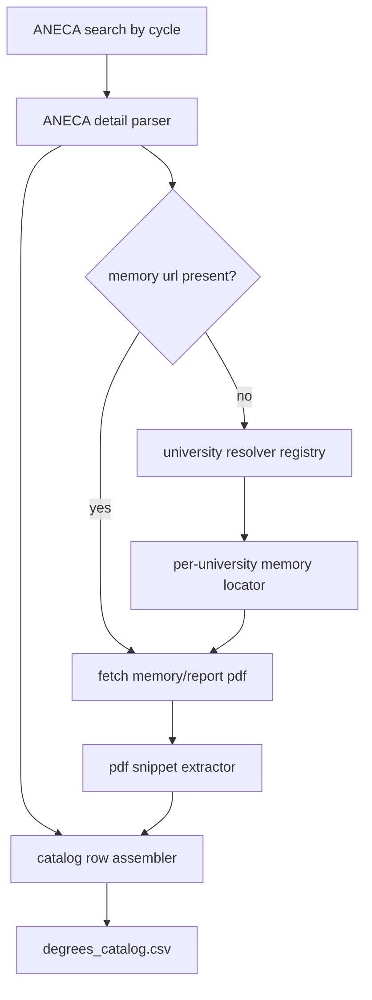

# feat: Scrape memorias ANECA for all Canary universities and title types

## Overview

Extend degree pipeline so `data/processed/degrees_catalog.csv` is built from ANECA verification artifacts plus university-hosted memoria links when ANECA pages lack direct memory URLs. Scope covers Canary universities (public + private) and all title types (`grado`, `master`, `doctorado`, plus future-proof fallback for other official cycles).

## Problem Frame

Current live ANECA scraper is effectively `grado`-centric and relies mostly on ANECA report PDFs. Request now needs robust catalog based on verification memories prepared by each Canary university, not only ANECA reports, and not only one title type. There is no guaranteed single repository for all memories, so pipeline must support per-university retrieval strategy while preserving one normalized output contract.

## Requirements Trace

- R1. Catalog must include Canary public and private universities in one run.
- R2. Catalog must include all title types (`grado`, `master`, `doctorado`) and remain extensible to additional official cycles.
- R3. Pipeline must prioritize ANECA discovery/provenance and resolve memoria URLs even when resolution requires university-specific scraping.
- R4. Output must remain `data/processed/degrees_catalog.csv` with stable, joinable fields for downstream mapping and ML.
- R5. Each record must preserve provenance (`source_url`, `memory_url`, resolution method, timestamps, status/error state).
- R6. Pipeline must degrade gracefully when one university blocks/changes layout, without aborting whole run.
- R7. Test strategy must be fixture/sample-based with deterministic parsing tests, avoiding brittle live-network dependence.

## Scope Boundaries

- Non-goal: full OCR pipeline for scanned memories in this phase.
- Non-goal: embedding generation changes; this plan only prepares richer degree catalog inputs.
- Non-goal: nationwide ingestion beyond Canary universities for this milestone.
- Non-goal: forcing one canonical text-summary algorithm for every memory PDF in this phase.

## Context & Research

### Relevant Code and Patterns

- `src/canarias_uni_ml/degrees/sources/aneca.py` already handles ANECA search/detail pagination and report selection; best base to generalize cycle filters.
- `src/canarias_uni_ml/degrees/catalog.py` centralizes build/write flow; correct seam for multi-source merge and fallback orchestration.
- `src/canarias_uni_ml/degrees/models.py` defines output row contract; provenance/status extensions belong here.
- `src/canarias_uni_ml/degrees/report_extract.py` already extracts description snippets from PDFs; reusable for memory PDFs once URL resolved.
- `src/canarias_uni_ml/cli.py` already exposes `degrees catalog` command; minimal CLI expansion should happen here.
- Existing tests (`tests/test_degree_catalog_parsing.py`, `tests/test_degree_storage.py`, `tests/test_cli_modes.py`) show fixture-first convention.

### Institutional Learnings

- `docs/degree-sources.md` already states ANECA + university fallback model; implementation still partial.
- Existing pipeline behavior confirms ANECA report URLs are often available, but direct memoria coverage is inconsistent.

### External References

- None required for planning pass; local codebase already contains direct ANECA integration and validated output samples.

## Key Technical Decisions

- **Discovery strategy:** Dual-stage (`ANECA index` -> `university-specific memory resolver`).
  - Rationale: ANECA gives authoritative title universe/provenance; university sites close memory-link gaps.
- **Title-type handling:** Add cycle abstraction (`grado/master/doctorado`) in ANECA source layer, not hardcoded constants.
  - Rationale: avoids per-type code duplication and supports future cycles.
- **University coverage:** Maintain explicit Canary-university registry in reference data.
  - Rationale: deterministic scope, easier audits, easy private/public tagging.
- **Failure policy:** Soft-fail per record/university with structured error fields.
  - Rationale: complete batch output even under partial source breakage.
- **Output contract:** Keep `degrees_catalog.csv` as primary artifact; append provenance/status columns rather than replacing existing core fields.
  - Rationale: preserve downstream compatibility.

## Open Questions

### Resolved During Planning

- Should this work replace ANECA sourcing with only university scraping? No. ANECA remains authoritative entrypoint.
- Should run stop if one university resolver fails? No. Record-level fallback and run-level continuation required.
- Should non-Canary universities be included now? No. Scope locked to Canary universities in this milestone.

### Deferred to Implementation

- Exact CSS/XPath selectors and sitemap endpoints per university memory pages.
- Final policy for choosing between multiple memory versions (latest verification vs latest modification vs both).
- Whether some doctorado records require alternate document types (memoria vs programa documentation).

## High-Level Technical Design

> *This illustrates intended approach and is directional guidance for review, not implementation specification. The implementing agent should treat it as context, not code to reproduce.*

## Implementation Units

- [ ] **Unit 1: Generalize ANECA ingestion to all title cycles**

**Goal:** Replace `grado`-only ANECA flow with cycle-aware ingestion for `grado/master/doctorado`.

**Requirements:** R2, R3, R4

**Dependencies:** None

**Files:**
- Modify: `src/canarias_uni_ml/degrees/sources/aneca.py`
- Modify: `src/canarias_uni_ml/degrees/catalog.py`
- Modify: `src/canarias_uni_ml/cli.py`
- Test: `tests/test_degree_catalog_parsing.py`
- Test: `tests/test_cli_modes.py`

**Approach:**
- Introduce cycle configuration map in ANECA source and iterate per requested cycles.
- Preserve existing parser behavior while threading `title_type` into produced records.
- Extend CLI with explicit cycle filters, defaulting to all three core cycles.

**Execution note:** Characterization-first on existing grado parser, then extend to additional cycles.

**Patterns to follow:**
- `src/canarias_uni_ml/degrees/sources/aneca.py` pagination + detail extraction pattern.
- `src/canarias_uni_ml/cli.py` subcommand argument pattern.

**Test scenarios:**
- Happy path: cycle list with `grado/master/doctorado` yields combined deterministic record set.
- Edge case: one cycle returns empty page set; others still processed.
- Error path: unsupported cycle flag returns clear validation error.
- Integration: CLI `degrees catalog` passes cycle filters into catalog builder correctly.

**Verification:**
- One run can produce mixed title types in output with explicit cycle field.

- [ ] **Unit 2: Add Canary university registry and scoped filtering**

**Goal:** Enforce canonical Canary-university scope (public/private) and make filtering auditable.

**Requirements:** R1, R4, R5

**Dependencies:** Unit 1

**Files:**
- Create: `data/reference/canary_universities.csv`
- Create: `src/canarias_uni_ml/degrees/university_registry.py`
- Modify: `src/canarias_uni_ml/degrees/sources/aneca.py`
- Modify: `src/canarias_uni_ml/degrees/models.py`
- Test: `tests/test_degree_catalog_parsing.py`

**Approach:**
- Store normalized university names + aliases + public/private tag in reference CSV.
- Match ANECA university text against registry aliases before inclusion.
- Persist matched canonical university id/name and ownership type in output rows.

**Patterns to follow:**
- Normalization alias pattern from `src/canarias_uni_ml/normalization/geography.py`.

**Test scenarios:**
- Happy path: known university alias maps to canonical registry row.
- Edge case: accent/casing variations still match same university.
- Error path: unknown university text marked `out_of_scope` without crashing run.
- Integration: canary-only filter produces rows exclusively for registry universities.

**Verification:**
- Scope filter no longer depends on ad-hoc string checks inside ANECA module.

- [ ] **Unit 3: Implement university-specific memoria resolvers**

**Goal:** Resolve missing memory links via per-university scraping strategy when ANECA detail lacks direct memoria URL.

**Requirements:** R3, R5, R6

**Dependencies:** Unit 2

**Files:**
- Create: `src/canarias_uni_ml/degrees/sources/universities/base.py`
- Create: `src/canarias_uni_ml/degrees/sources/universities/ull.py`
- Create: `src/canarias_uni_ml/degrees/sources/universities/ulpgc.py`
- Create: `src/canarias_uni_ml/degrees/sources/universities/uec.py`
- Create: `src/canarias_uni_ml/degrees/sources/universities/uam.py`
- Create: `src/canarias_uni_ml/degrees/sources/universities/ufpc.py`
- Create: `src/canarias_uni_ml/degrees/sources/universities/__init__.py`
- Create: `src/canarias_uni_ml/degrees/memory_resolver.py`
- Modify: `src/canarias_uni_ml/degrees/catalog.py`
- Test: `tests/test_memory_resolver.py`

**Approach:**
- Define resolver interface (`resolve_memory_url(record_context) -> resolution result`).
- Register resolver by canonical university id, with common fallback heuristics.
- Return structured result: `memory_url`, `resolution_source`, `resolution_confidence`, `resolution_error`.

**Execution note:** Implement as isolated adapters per university to reduce selector-coupling blast radius.

**Technical design:** *(directional guidance)* Memory resolution pipeline: `ANECA row -> canonical university id -> resolver dispatch -> candidate URL ranking -> chosen URL + trace`.

**Patterns to follow:**
- Source abstraction style in `src/canarias_uni_ml/degrees/sources/base.py`.

**Test scenarios:**
- Happy path: missing ANECA memory URL gets resolved from university-specific page.
- Edge case: resolver finds multiple memory PDFs, selects highest-ranked candidate by policy.
- Error path: resolver timeout/layout change returns structured error, row still emitted.
- Integration: mixed batch with resolved + unresolved rows writes both with proper statuses.

**Verification:**
- Catalog run survives partial resolver failures and retains explicit provenance for each row.

- [ ] **Unit 4: Extend degree record contract for provenance and resilience**

**Goal:** Make `degrees_catalog.csv` self-describing for downstream joins, QA, and reruns.

**Requirements:** R4, R5, R6

**Dependencies:** Units 1-3

**Files:**
- Modify: `src/canarias_uni_ml/degrees/models.py`
- Modify: `src/canarias_uni_ml/degrees/catalog.py`
- Modify: `src/canarias_uni_ml/io.py`
- Test: `tests/test_degree_storage.py`

**Approach:**
- Add columns: `title_type`, `university_id`, `university_type`, `memory_resolution_source`, `memory_resolution_status`, `memory_resolution_error`.
- Maintain backward-compatible existing columns (`source`, `title`, `branch`, `memory_url`, etc.).
- Ensure deterministic column order and null handling in CSV/SQLite writes.

**Patterns to follow:**
- Dataclass-to-row pattern in `src/canarias_uni_ml/degrees/models.py`.
- Storage parity pattern in `src/canarias_uni_ml/io.py` and `tests/test_degree_storage.py`.

**Test scenarios:**
- Happy path: resolved record writes new provenance columns with expected values.
- Edge case: unresolved memory row still valid CSV row with status/error populated.
- Error path: row with unusually long error detail is safely serialized.
- Integration: CSV and SQLite outputs keep same schema/field names.

**Verification:**
- Downstream processes can filter by cycle, university type, and memory-resolution status without extra joins.

- [ ] **Unit 5: Build regression and fixture suite for multi-university/multi-cycle behavior**

**Goal:** Lock behavior against ANECA HTML drift and university-site variability.

**Requirements:** R6, R7

**Dependencies:** Units 1-4

**Files:**
- Create: `tests/fixtures/aneca_search_master_sample.html`
- Create: `tests/fixtures/aneca_search_doctorado_sample.html`
- Create: `tests/fixtures/university_memory_samples/*.html`
- Modify: `tests/test_degree_catalog_parsing.py`
- Create: `tests/test_university_resolvers.py`
- Modify: `docs/degree-sources.md`

**Approach:**
- Add fixture packs per cycle and per university resolver.
- Separate parser tests from resolver orchestration tests.
- Document refresh policy for fixtures when upstream layouts change.

**Patterns to follow:**
- Existing fixture-based parser testing approach in `tests/test_degree_catalog_parsing.py`.

**Test scenarios:**
- Happy path: each university resolver extracts at least one expected memoria URL from fixture.
- Edge case: fixture with missing anchor fields produces unresolved status, not exception.
- Error path: malformed ANECA detail HTML yields partial row with parser error marker.
- Integration: end-to-end catalog build from fixture bundle yields deterministic row count and schema.

**Verification:**
- Degree ingestion changes can be validated offline with stable fixtures before live runs.

## System-Wide Impact

- **Interaction graph:** `degrees cli` -> `catalog builder` -> `ANECA source` + `university resolvers` -> `report/memory extract` -> CSV/SQLite outputs.
- **Error propagation:** University resolver and PDF failures become row-level status/error fields; run-level fatal errors reserved for config/IO failures.
- **State lifecycle risks:** Duplicate rows when same title appears across cycles or alias names; mitigate via canonical keys and cycle-aware dedupe.
- **API surface parity:** `degrees catalog` CLI flags expand; existing default behavior must still generate valid catalog without requiring new flags.
- **Integration coverage:** Need cross-layer tests for cycle filtering + resolver dispatch + storage schema parity.
- **Unchanged invariants:** Output target path remains `data/processed/degrees_catalog.csv`; existing core degree fields remain present.

## Risks & Dependencies

| Risk | Mitigation |
|------|------------|
| University websites inconsistent or anti-bot | Per-university adapters, soft-fail status fields, cached fixtures for deterministic tests |
| ANECA HTML changes across cycles | Cycle-specific fixtures and parser fallbacks (`views-table` + legacy layout) |
| Ambiguous memory document selection | Explicit ranking policy + provenance columns + deferred manual review queue |
| Schema drift breaks downstream mapping | Preserve current columns, append-only evolution, storage regression tests |

## Documentation / Operational Notes

- Update `docs/degree-sources.md` with resolver map per university and known caveats.
- Add short runbook section in `README.md` for `degrees catalog --cycles ... --canary-only` usage and troubleshooting unresolved memories.
- Track unresolved-memory rate after each run as quality KPI.

## Sources & References

- Related code: `src/canarias_uni_ml/degrees/sources/aneca.py`
- Related code: `src/canarias_uni_ml/degrees/catalog.py`
- Related code: `src/canarias_uni_ml/degrees/models.py`
- Related tests: `tests/test_degree_catalog_parsing.py`
- Related doc: `docs/degree-sources.md`
