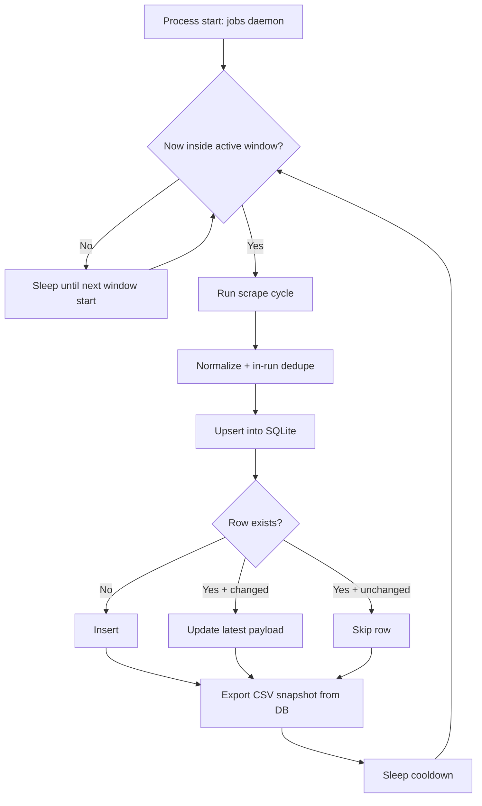

# feat: Nightly jobs daemon with persistent upsert and no-duplicate storage

## Overview

Convert current batch CSV workflow into persistent nightly daemon that runs once, stays alive, scrapes continuously during low-traffic window (example: 22:00-07:30 Europe/Madrid), and preserves one canonical row per job with update-on-change semantics.

## Problem Frame

Current jobs pipeline is run-by-command and writes fresh CSV snapshots. It deduplicates inside one run but does not persist record history for cross-night upsert decisions. Target operating model is unattended long-running process on remote always-on machine, with explicit stop control, nightly execution window, and deterministic no-duplicate behavior.

## Requirements Trace

- R1. Process can be started once on remote machine and remain alive until explicitly stopped.
- R2. Scraping executes only within configured nightly window (default example 22:00-07:30, local timezone Europe/Madrid).
- R3. During active window, scraper loops continuously (bounded pause between cycles) without manual relaunch.
- R4. Storage has no duplicates across nights; each logical job exists once.
- R5. On duplicate key detection, compare stored vs scraped payload; update stored row only when content changed; otherwise skip.
- R6. Before permanent launch, provide deterministic verification path proving scheduler + upsert behavior.
- R7. Repository docs updated with deployment/operations instructions for remote host.
- R8. Final workflow includes branch, commit, and push target aligned with `feat/canarias...`.

## Scope Boundaries

- No goal: redesign individual spiders or source extraction strategies.
- No goal: guarantee 100% source availability (Cloudflare / anti-bot still best-effort).
- No goal: build distributed queue system; single-host daemon is target.

## Context & Research

### Relevant Code and Patterns

- `src/canarias_uni_ml/cli.py`: multi-domain command entrypoint; add new jobs daemon command here.
- `src/canarias_uni_ml/jobs/pipeline.py`: current scrape orchestration, in-run dedupe, CSV output.
- `src/canarias_uni_ml/jobs/scale.py`: canonical cleaning + dedupe key helpers worth reusing for persistence key strategy.
- `src/canarias_uni_ml/io.py`: existing SQLite writer utility shows repo already accepts SQLite output.
- `src/canarias_uni_ml/config.py`: central output paths; extend with jobs DB path and daemon defaults.
- `tests/test_jobs_pipeline.py`, `tests/test_cli_modes.py`: existing test anchors for parser + pipeline behavior.
- `AGENTS.md`: sample-based tests preferred; avoid live flaky integration dependence.

### Institutional Learnings

- No `docs/solutions/` directory present; no prior institutional solution notes available for this feature.

### External References

- None required for planning; implementation can use Python stdlib (`sqlite3`, `zoneinfo`, `datetime`) to avoid new runtime dependency.

## Key Technical Decisions

- **Persistent canonical store = SQLite DB**: local durable upsert semantics, no external service dependency, suitable for always-on single host.
- **Canonical dedupe key strategy**: `source + external_id` when available, fallback normalized `source_url`, final fallback deterministic content key; ensures stable uniqueness across heterogeneous sources.
- **Change detection via content hash**: compare persisted payload hash (excluding volatile fields like `scraped_at`) against new hash to decide update vs skip.
- **Night window controlled by daemon loop (not cron-only)**: one long-lived process computes active/inactive periods and self-sleeps outside window, matching “launch once, keep alive” requirement.
- **CSV remains derived artifact**: DB is source of truth; CSV exported after each successful cycle for compatibility with existing downstream consumers.
- **Single-instance lock**: daemon uses lockfile/PID strategy to avoid overlapping concurrent runs on same host.

## Open Questions

### Resolved During Planning

- **Timezone for schedule evaluation**: Use explicit `Europe/Madrid` default, overridable by CLI/env for portability.
- **Meaning of “sin parar” inside window**: interpret as repeated scrape cycles with configurable cooldown (for example 5-15 min), not one single long scrape.
- **Where duplicates are prevented**: persistence layer, not just in-memory dedupe.

### Deferred to Implementation

- Exact hash field list and canonical serialization order.
- Final cooldown default after first benchmark cycle on target machine.
- Whether to keep optional audit table (`job_versions`) in v1 or postpone to v2.

## High-Level Technical Design

> *This illustrates the intended approach and is directional guidance for review, not implementation specification. The implementing agent should treat it as context, not code to reproduce.*

## Implementation Units

- [ ] **Unit 1: Build persistent jobs repository with deterministic upsert**

**Goal:** Introduce storage module that enforces unique logical jobs and updates rows only when payload changes.

**Requirements:** R4, R5

**Dependencies:** None

**Files:**
- Create: `src/canarias_uni_ml/jobs/storage.py`
- Modify: `src/canarias_uni_ml/config.py`
- Test: `tests/test_jobs_storage.py`

**Approach:**
- Define SQLite schema for canonical jobs table with unique key, payload hash, timestamps (`first_seen_at`, `last_seen_at`, `updated_at`).
- Implement repository API returning counters (`inserted`, `updated`, `unchanged`) for observability.
- Use transaction batches to keep writes atomic per cycle.

**Patterns to follow:**
- `src/canarias_uni_ml/io.py` SQLite conventions.
- `src/canarias_uni_ml/jobs/scale.py::_canonical_dedupe_key` for stable key ideas.

**Test scenarios:**
- Happy path: new record key not present -> inserted count increments, row persisted.
- Happy path: same key with changed normalized fields -> updated count increments, row overwritten with latest content.
- Edge case: same key and identical content -> unchanged count increments, stored payload remains same.
- Edge case: missing `external_id` but valid `source_url` -> fallback key still unique and stable.
- Error path: malformed row missing required identity fields -> repository rejects row with explicit error.

**Verification:**
- Repository can execute three-way decision (insert/update/skip) deterministically for fixture dataset.

- [ ] **Unit 2: Refactor jobs pipeline to persist first, export snapshot second**

**Goal:** Route scrape outputs through storage upsert and generate CSV from DB canonical state.

**Requirements:** R4, R5

**Dependencies:** Unit 1

**Files:**
- Modify: `src/canarias_uni_ml/jobs/pipeline.py`
- Modify: `src/canarias_uni_ml/jobs/scale.py`
- Modify: `src/canarias_uni_ml/cli.py`
- Test: `tests/test_jobs_pipeline.py`

**Approach:**
- Keep existing source fetch and normalization flow.
- Replace direct CSV write as primary sink with repository upsert call.
- Emit end-of-cycle metrics (`scraped`, `inserted`, `updated`, `unchanged`, `failures`) and then export canonical CSV.

**Execution note:** Start with failing behavior tests for update-vs-skip semantics before refactor.

**Patterns to follow:**
- Current threading/error handling in `src/canarias_uni_ml/jobs/pipeline.py`.
- Existing cleaning functions in `src/canarias_uni_ml/jobs/scale.py`.

**Test scenarios:**
- Happy path: first pipeline run with fixtures inserts N rows and exports N-row CSV.
- Integration: second run with mixed unchanged and changed duplicates updates only changed rows, CSV row count remains deduped.
- Edge case: spider source failure occurs while others succeed -> partial success still upserts available records.
- Error path: DB unavailable during write -> pipeline reports failure and exits non-zero for operational visibility.

**Verification:**
- Running two sequential fixture-based cycles demonstrates no duplicate growth and correct update counters.

- [ ] **Unit 3: Add nightly daemon scheduler command**

**Goal:** Provide long-running command that self-manages active/sleep windows and repeated cycles.

**Requirements:** R1, R2, R3

**Dependencies:** Unit 2

**Files:**
- Create: `src/canarias_uni_ml/jobs/daemon.py`
- Modify: `src/canarias_uni_ml/cli.py`
- Modify: `src/canarias_uni_ml/config.py`
- Test: `tests/test_jobs_daemon_schedule.py`
- Test: `tests/test_cli_modes.py`

**Approach:**
- Implement scheduler utility that handles same-day and cross-midnight windows (`22:00` to `07:30`).
- Add `jobs daemon` subcommand with flags for start/end time, timezone, cooldown minutes, one-shot dry cycle.
- Use structured cycle loop: wait-until-window -> run-cycle -> cooldown -> repeat.

**Patterns to follow:**
- CLI style in `src/canarias_uni_ml/cli.py`.
- Existing `run_jobs_pipeline` invocation boundary.

**Test scenarios:**
- Happy path: timestamp inside active window -> cycle starts immediately.
- Edge case: timestamp outside active window -> scheduler computes next start correctly.
- Edge case: cross-midnight windows evaluate correctly around 23:30, 03:00, 08:00 cases.
- Error path: invalid time window format -> CLI exits with parse error.

**Verification:**
- Deterministic clock-driven tests confirm scheduler state transitions without real-time sleeping.

- [ ] **Unit 4: Add single-instance safety and stop semantics for remote host**

**Goal:** Ensure daemon behaves safely in unattended environment and can be stopped cleanly.

**Requirements:** R1, R3

**Dependencies:** Unit 3

**Files:**
- Modify: `src/canarias_uni_ml/jobs/daemon.py`
- Create: `tests/test_jobs_daemon_runtime.py`
- Create: `docs/operations/jobs-daemon.md`

**Approach:**
- Add lockfile/PID guard to prevent double start.
- Handle SIGTERM/SIGINT to finish current cycle and shutdown cleanly.
- Emit concise runtime logs with cycle outcome counters for remote diagnosis.

**Patterns to follow:**
- Existing error-reporting print patterns in jobs pipeline.

**Test scenarios:**
- Happy path: signal during sleep or idle window -> daemon exits gracefully.
- Edge case: second daemon start while lock active -> start denied with actionable message.
- Error path: lockfile stale after crash -> stale detection and recovery path.

**Verification:**
- Runtime tests show predictable start/stop behavior and single-instance guarantee.

- [ ] **Unit 5: Build pre-launch validation protocol**

**Goal:** Define and automate confidence checks before enabling continuous unattended execution.

**Requirements:** R6

**Dependencies:** Units 1-4

**Files:**
- Create: `tests/test_jobs_nightly_e2e.py`
- Modify: `README.md`
- Modify: `docs/source-notes.md`

**Approach:**
- Add fixture-driven end-to-end test simulating two nightly cycles with controlled changes.
- Verify scheduler + upsert + export integrated behavior with fake clock and mocked spider outputs.
- Document preflight checklist (environment vars, writable paths, expected counters, rollback/stop procedure).

**Execution note:** Characterization-first for current pipeline output contract before asserting new counters.

**Patterns to follow:**
- Sample-based testing guidance from `AGENTS.md`.

**Test scenarios:**
- Integration: cycle 1 inserts baseline rows; cycle 2 updates subset and skips unchanged subset.
- Integration: no duplicate rows after repeated cycles.
- Error path: one spider throws error in cycle 2; daemon continues next cycle and records failure.

**Verification:**
- End-to-end fixture test proves requirements R2-R6 before production launch.

- [ ] **Unit 6: Document deployment flow and VCS handoff requirements**

**Goal:** Capture exact operational steps for remote launch and repository delivery expectations.

**Requirements:** R7, R8

**Dependencies:** Units 1-5

**Files:**
- Modify: `README.md`
- Create: `docs/operations/remote-nightly-deploy.md`
- Create: `deploy/systemd/canarias-jobs-daemon.service`

**Approach:**
- Document remote machine bootstrap, daemon start mode, monitoring, stop command, and recovery.
- Add branch naming convention note: feature branch prefix `feat/canarias...`.
- Record expected commit scope: code, tests, docs together after validation passes.
- Provide service unit template so daemon auto-restarts on host reboot while preserving in-process window logic.

**Patterns to follow:**
- Existing operational guidance style in `README.md`.

**Test scenarios:**
- Test expectation: none -- documentation-only unit.

**Verification:**
- Operator can follow docs to launch one persistent process with nightly window behavior and clean stop path.

## System-Wide Impact

- **Interaction graph:** CLI -> jobs daemon -> jobs pipeline -> spiders -> normalization -> SQLite repository -> CSV export.
- **Error propagation:** spider-level failures stay non-fatal per cycle; storage/scheduler fatal errors surface immediately and end process with non-zero status.
- **State lifecycle risks:** lockfile staleness, DB growth, partial cycle writes; mitigate with transaction boundaries and stale-lock cleanup.
- **API surface parity:** existing `jobs scrape`/`jobs scale` remain usable; new `jobs daemon` extends without breaking current interfaces.
- **Integration coverage:** multi-cycle fixture tests required because unit tests alone cannot prove scheduler/storage interplay.
- **Unchanged invariants:** source-specific scraping logic stays in spider modules; normalization remains shared utilities.

## Risks & Dependencies

| Risk | Mitigation |
|------|------------|
| Anti-bot or source outage during nightly cycles | Keep per-source failure isolation; continue other sources; log failure counters |
| Wrong dedupe key collapses distinct jobs | Add deterministic key tests and fallback hierarchy validation |
| Daemon runs outside intended window due timezone mismatch | Explicit timezone config + schedule tests around midnight boundaries |
| SQLite file contention or corruption after host crash | Single-process lock, short transactions, backup/rotate policy in ops doc |
| Infinite loop without visibility | Per-cycle structured logs and status counters persisted to output |
| Missing runtime dependencies on remote host (Playwright/browser, env vars) | Add preflight dependency checks and explicit startup failure messages before entering daemon loop |

## Dependencies / Prerequisites

- Remote host has Python venv, project code, and write access to `data/processed/`.
- Playwright Chromium runtime installed for sources that require browser execution.
- Required source credentials/secrets available via environment (`INFOJOBS_CLIENT_ID`, `INFOJOBS_CLIENT_SECRET`, optional proxy settings).
- Host clock sync (NTP) enabled so window boundaries evaluate correctly.

## Documentation / Operational Notes

- Recommend service manager deployment on remote host (`systemd` service) running `jobs daemon`; restart policy `always`.
- Keep DB file under `data/processed/` and snapshot CSV as downstream artifact.
- Define retention/backup policy for DB and logs in operations doc.
- Production launch gate: run validation protocol first, then switch to persistent mode.

## Sources & References

- Related code: `src/canarias_uni_ml/cli.py`, `src/canarias_uni_ml/jobs/pipeline.py`, `src/canarias_uni_ml/jobs/scale.py`, `src/canarias_uni_ml/io.py`
- Related tests: `tests/test_jobs_pipeline.py`, `tests/test_cli_modes.py`
- Repo constraints: `AGENTS.md`
