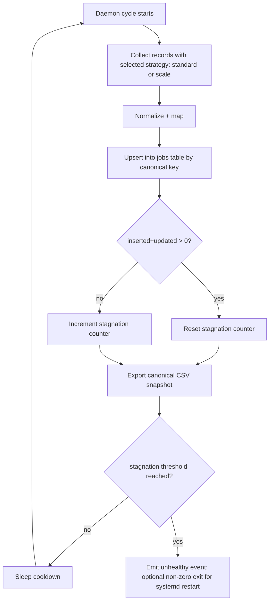

# fix: Stabilize nightly jobs daemon dedupe, append-only persistence, and throughput

## Overview

Harden the nightly jobs daemon so it keeps append-only history in the canonical DB without duplicate logical jobs, preserves the latest version of each job post, and increases nightly scrape throughput from current low output to sustained high-volume collection.

## Problem Frame

The remote nightly process is reported as still running but not collecting additional jobs, current dataset contains many duplicates, and observed throughput is far below target (roughly tens per day instead of hundreds/thousands per night). The desired operating mode is unattended overnight scraping that appends newly discovered jobs, updates existing jobs when they change, and deduplicates historical data already persisted.

This plan assumes the user-reported duplicate issue applies to the remote persisted jobs dataset (CSV/SQLite outputs), even though the local `data/processed/degrees_catalog.csv` sample in this workspace is currently not showing duplicate keys by `(university, title, title_type)`.

## Requirements Trace

- R1. Existing persisted job data is cleaned so duplicate logical jobs are removed while preserving the latest version.
- R2. Future writes remain append-oriented at the dataset level: newly discovered jobs are added, existing logical jobs are updated in place, and no full destructive overwrite of canonical storage occurs.
- R3. Dedupe/upsert identity is robust across heterogeneous sources and stable across repeated daemon cycles.
- R4. Daemon can no longer appear alive while silently making no forward progress for long periods.
- R5. Nightly throughput is increased substantially via better cycle sizing, source strategy, and runtime controls.
- R6. Operators can diagnose remote stagnation quickly using logs/metrics and runbook steps.

## Scope Boundaries

- No goal: redesign all spiders from scratch.
- No goal: guarantee scraping from sources currently blocked by anti-bot controls.
- No goal: introduce distributed infrastructure (queues/workers) in this pass.

## Context & Research

### Relevant Code and Patterns

- `src/canarias_uni_ml/jobs/storage.py` already implements upsert (`inserted/updated/unchanged`) with canonical key + payload hash.
- `src/canarias_uni_ml/jobs/pipeline.py` currently limits per-cycle volume using `limit_per_source` and optional `max_total` source-coverage slicing.
- `src/canarias_uni_ml/jobs/daemon.py` runs windowed loop and locking, but has no explicit forward-progress watchdog.
- `src/canarias_uni_ml/jobs/scale.py` contains high-volume collection logic and source-share strategy not yet integrated into daemon mode.
- `src/canarias_uni_ml/jobs/spiders/jobspy_spider.py` performs many small location queries (`results_wanted=min(limit, 50)`), which can constrain throughput.
- `deploy/systemd/canarias-jobs-daemon.service` and `docs/operations/*.md` define current remote runtime and ops path.

### Institutional Learnings

- No `docs/solutions/` entries found for this failure mode; plan relies on repository code/doc patterns.

### External References

- Not required for planning; immediate issues are internal behavior, configuration, and observability.

## Key Technical Decisions

- **Canonical source of truth remains SQLite jobs table**: continue upsert model, avoid destructive full rewrites.
- **Add one-time in-place compaction/migration command**: dedupe existing persisted jobs by canonical identity, keeping the row with newest business freshness signal (`update_date`, fallback `publication_date`, fallback `updated_at`).
- **Promote canonical key consistency across runtime paths**: ensure pipeline, scale mode, and any maintenance commands use the same key semantics.
- **Introduce progress watchdog in daemon loop**: detect repeated cycles with zero inserts/updates and escalate (warning, optional process exit for systemd restart).
- **Unify nightly daemon with scalable collection path**: add mode/flags so daemon can run high-volume strategy (time-budgeted) instead of small fixed per-source slices.
- **Strengthen operational telemetry**: per-cycle metrics and source-level timings/errors become first-class outputs for remote diagnosis.

## Open Questions

### Resolved During Planning

- **Should current DB be overwritten?** No. Canonical DB is retained; dedupe is done as in-place compaction plus normal upsert behavior.
- **What does “keep latest job version” mean?** Latest logical record wins per canonical key, based on freshness fields and payload update detection.
- **How to treat long-running but non-productive daemon?** Treat as unhealthy after configurable stagnation threshold and surface clear operator signal.

### Deferred to Implementation

- Final freshness tie-break order when some sources lack reliable `update_date`.
- Exact default thresholds for stagnation alerts and forced restart behavior.
- Whether dedupe compaction runs automatically at daemon startup or only via explicit maintenance command.

## High-Level Technical Design

> *This illustrates the intended approach and is directional guidance for review, not implementation specification. The implementing agent should treat it as context, not code to reproduce.*

## Implementation Units

- [x] **Unit 1: Add maintenance compaction for existing duplicate jobs**

**Goal:** Deduplicate already-persisted jobs without deleting canonical dataset history, keeping latest version per logical key.

**Requirements:** R1, R2, R3

**Dependencies:** None

**Files:**
- Modify: `src/canarias_uni_ml/jobs/storage.py`
- Modify: `src/canarias_uni_ml/cli.py`
- Test: `tests/test_jobs_storage.py`
- Test: `tests/test_cli_modes.py`

**Approach:**
- Add repository method + CLI subcommand (for example `jobs compact`) that scans persisted rows, groups by canonical identity, and rewrites table content transactionally with winners only.
- Winner selection uses freshest available timestamp semantics with deterministic tie-breaker.
- Print compaction report (`before`, `after`, `removed`, `ambiguous_ties`).

**Execution note:** Start with characterization tests from synthetic DB fixtures containing known duplicate clusters.

**Patterns to follow:**
- Existing `JobsRepository` transaction/write style in `src/canarias_uni_ml/jobs/storage.py`.
- Existing CLI subcommand wiring in `src/canarias_uni_ml/cli.py`.

**Test scenarios:**
- Happy path: duplicate cluster with one newer `update_date` keeps newest row, removes older rows.
- Edge case: missing `update_date` falls back to `publication_date` then storage metadata tie-break consistently.
- Edge case: identical payload duplicates collapse to one row with deterministic winner.
- Error path: malformed row missing identity fields is reported and skipped/failed according to chosen policy.
- Integration: compaction followed by normal scrape cycle does not reintroduce immediate duplicates.

**Verification:**
- Running compaction on fixture DB yields reduced row count and exactly one row per canonical key.

- [x] **Unit 2: Tighten canonical key and latest-version semantics in upsert path**

**Goal:** Ensure every ingestion path applies consistent identity and update semantics so duplicates do not regrow.

**Requirements:** R2, R3

**Dependencies:** Unit 1

**Files:**
- Modify: `src/canarias_uni_ml/jobs/storage.py`
- Modify: `src/canarias_uni_ml/jobs/pipeline.py`
- Modify: `src/canarias_uni_ml/jobs/scale.py`
- Test: `tests/test_jobs_storage.py`
- Test: `tests/test_jobs_pipeline.py`

**Approach:**
- Audit and unify canonical key behavior between standard and scale paths to avoid mismatched dedupe identities.
- Explicitly handle update freshness for payload changes (for example prioritize `update_date` deltas over scrape-time noise).
- Emit counters for collisions by key type (`external_id`, `source_url`, fallback-row-key`) to detect weak identities.

**Patterns to follow:**
- Existing `canonical_job_key` and `payload_hash` pattern in `src/canarias_uni_ml/jobs/storage.py`.
- Existing normalization flow in `src/canarias_uni_ml/jobs/scale.py::_clean_record`.

**Test scenarios:**
- Happy path: same job with changed description updates single row in place.
- Edge case: record without `external_id` but with stable URL maps to same key across runs.
- Edge case: source-provided IDs reused across different URLs are disambiguated correctly (or flagged).
- Error path: inconsistent identity fields across cycles produce warning metric and deterministic behavior.
- Integration: repeated two-cycle fixture run keeps row cardinality stable while applying valid updates.

**Verification:**
- Consecutive pipeline runs show stable deduped cardinality with non-zero update behavior when fixture payload changes.

- [x] **Unit 3: Add daemon progress watchdog and health-oriented exit behavior**

**Goal:** Prevent the “process alive but no progress” blind spot.

**Requirements:** R4, R6

**Dependencies:** Unit 2

**Files:**
- Modify: `src/canarias_uni_ml/jobs/daemon.py`
- Modify: `src/canarias_uni_ml/jobs/pipeline.py`
- Modify: `deploy/systemd/canarias-jobs-daemon.service`
- Test: `tests/test_jobs_daemon_runtime.py`
- Test: `tests/test_jobs_daemon_schedule.py`

**Approach:**
- Return structured cycle outcome from pipeline (`scraped`, `inserted`, `updated`, `unchanged`, `failures`, elapsed seconds).
- Track consecutive non-progress cycles (`inserted+updated==0`) and emit escalating warnings.
- Add optional fail-fast threshold causing non-zero exit so `systemd Restart=always` can recycle a stuck runtime state.

**Patterns to follow:**
- Existing signal handling and lock lifecycle in `src/canarias_uni_ml/jobs/daemon.py`.
- Existing runtime tests in `tests/test_jobs_daemon_runtime.py`.

**Test scenarios:**
- Happy path: productive cycle resets non-progress counter.
- Edge case: several non-productive cycles below threshold logs warning but continues.
- Edge case: threshold reached triggers configured non-zero exit for supervisor restart.
- Error path: one spider repeatedly failing still surfaces source-specific failure counts.
- Integration: simulated daemon loop with mixed productive/non-productive cycles transitions states correctly.

**Verification:**
- Daemon logs clearly expose stagnation state and can intentionally self-restart under configured policy.

- [x] **Unit 4: Integrate high-throughput collection mode into nightly daemon**

**Goal:** Raise nightly collection volume from small fixed batches toward target high-volume scraping.

**Requirements:** R5

**Dependencies:** Unit 2

**Files:**
- Modify: `src/canarias_uni_ml/jobs/daemon.py`
- Modify: `src/canarias_uni_ml/jobs/pipeline.py`
- Modify: `src/canarias_uni_ml/jobs/scale.py`
- Modify: `src/canarias_uni_ml/cli.py`
- Test: `tests/test_jobs_pipeline.py`
- Test: `tests/test_jobs_daemon_runtime.py`

**Approach:**
- Add daemon mode/flag to choose strategy per cycle (`scrape` vs `scale`) with explicit time budget.
- Increase per-cycle fetch potential (larger page sizes, fewer repeated tiny queries, bounded concurrency/timeouts).
- Keep source fairness controls and prevent one slow source from starving full cycle progress.

**Execution note:** Characterize current throughput with deterministic mocked source counts before changing defaults.

**Patterns to follow:**
- Existing `run_scaled` source-share model in `src/canarias_uni_ml/jobs/scale.py`.
- Existing thread-based source fan-out in `src/canarias_uni_ml/jobs/pipeline.py`.

**Test scenarios:**
- Happy path: scale strategy cycle ingests more records than standard strategy under same mocked source availability.
- Edge case: one source timeout does not block other sources from completing cycle.
- Edge case: cycle respects configured runtime budget and exits cleanly.
- Error path: invalid strategy flag rejected at CLI parse boundary.
- Integration: daemon configured for scale strategy writes upsert counters and valid CSV snapshot.

**Verification:**
- Controlled benchmark fixtures show materially higher per-night insertion capacity with bounded failures.

- [x] **Unit 5: Strengthen remote operations runbook for diagnosis and safe rollout**

**Goal:** Give operators concrete procedures to run compaction, observe health, and tune throughput safely on remote host.

**Requirements:** R6

**Dependencies:** Units 1-4

**Files:**
- Modify: `docs/operations/jobs-daemon.md`
- Modify: `docs/operations/remote-nightly-deploy.md`
- Test: `tests/test_readme_commands_smoke.py`

**Approach:**
- Document exact maintenance sequence: stop daemon, backup DB, run compaction, run one-cycle preflight, restart daemon.
- Add troubleshooting section for “alive but no new jobs,” including expected log signatures and threshold responses.
- Add throughput tuning matrix (`cooldown`, strategy, per-source limits, runtime budget).

**Patterns to follow:**
- Existing operations documentation style in `docs/operations/*.md`.

**Test scenarios:**
- Test expectation: none -- documentation-only unit; ensure command snippets remain aligned with CLI surface via smoke test updates.

**Verification:**
- Operators can execute documented workflow end-to-end without ambiguous steps.

## System-Wide Impact

- **Interaction graph:** `cli -> daemon -> pipeline/scale -> storage -> CSV snapshot` plus `systemd` supervisor behavior.
- **Error propagation:** Source-level failures should degrade gracefully while still exposing cycle health and stagnation transitions.
- **State lifecycle risks:** Compaction must be transactional to avoid partial-write corruption; daemon restart logic must not thrash on transient low-volume periods.
- **API surface parity:** New CLI maintenance and strategy flags must be reflected in docs and smoke tests.
- **Integration coverage:** Multi-cycle daemon tests needed to prove watchdog + upsert + compaction interaction.
- **Unchanged invariants:** Canonical output artifacts remain `data/processed/canarias_jobs.db` and `data/processed/canarias_jobs.csv`; no change to degree-catalog pipeline behavior in this fix.

## Risks & Dependencies

| Risk | Mitigation |
|------|------------|
| Freshness tie-break chooses wrong “latest” row for some sources | Encode explicit precedence and cover with fixtures representing missing/contradictory dates |
| Watchdog causes restart loops during legitimate low-volume windows | Use configurable thresholds and separate warning-only vs fail-fast modes |
| Throughput tuning increases source blocking/anti-bot events | Add bounded timeouts/backoff, preserve per-source failure isolation |
| Compaction on large DB causes lock contention | Run as explicit maintenance command with documented stop-daemon prerequisite |

## Documentation / Operational Notes

- Rollout should sequence: implement + test -> run compaction on remote copy -> run daemon `--run-once` -> enable overnight scale strategy.
- Keep at least one dated backup snapshot of DB before first compaction in production-like host.
- Add log retention guidance in runbook so overnight diagnostics remain available.

## Sources & References

- Related code: `src/canarias_uni_ml/jobs/storage.py`, `src/canarias_uni_ml/jobs/pipeline.py`, `src/canarias_uni_ml/jobs/daemon.py`, `src/canarias_uni_ml/jobs/scale.py`
- Related docs: `docs/operations/jobs-daemon.md`, `docs/operations/remote-nightly-deploy.md`
- Related plan: `docs/plans/2026-04-22-003-feat-nightly-jobs-daemon-upsert-plan.md`
